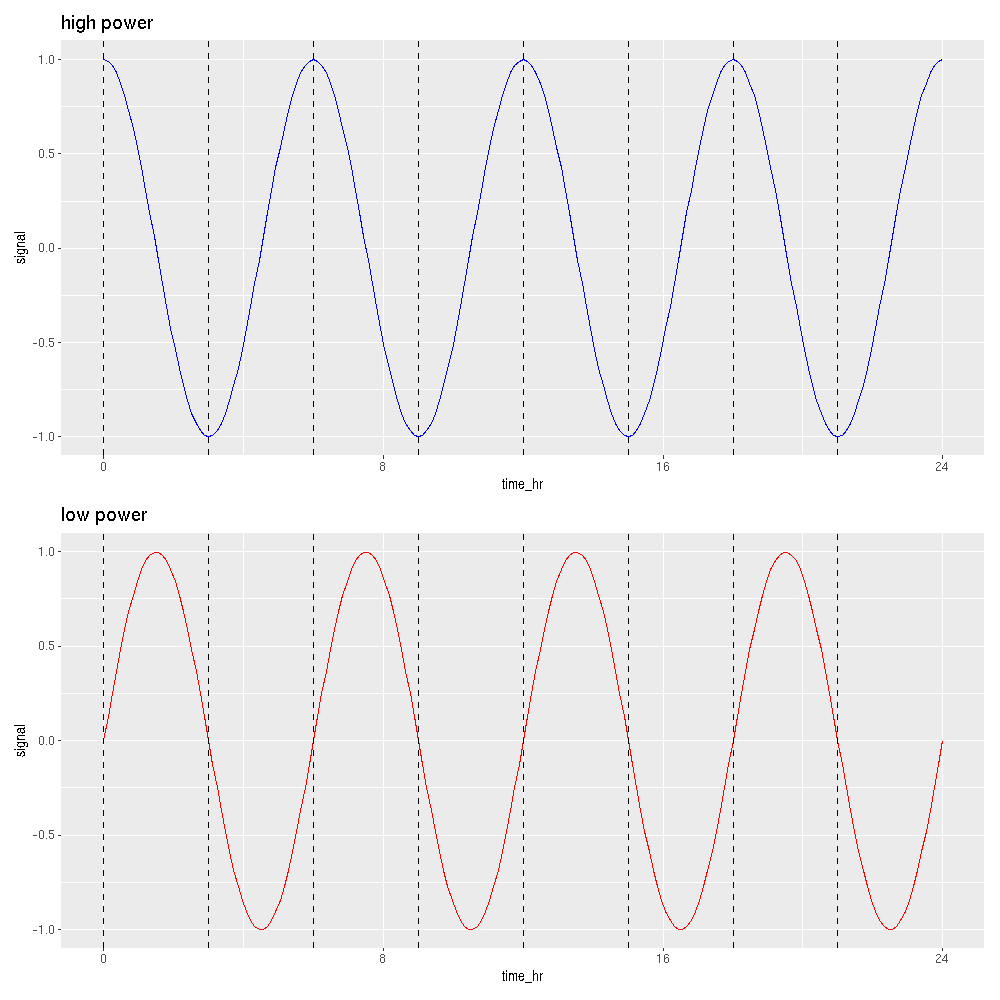
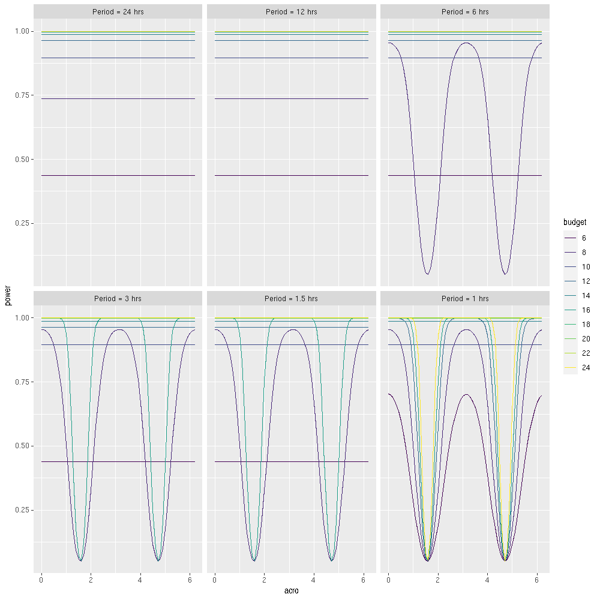
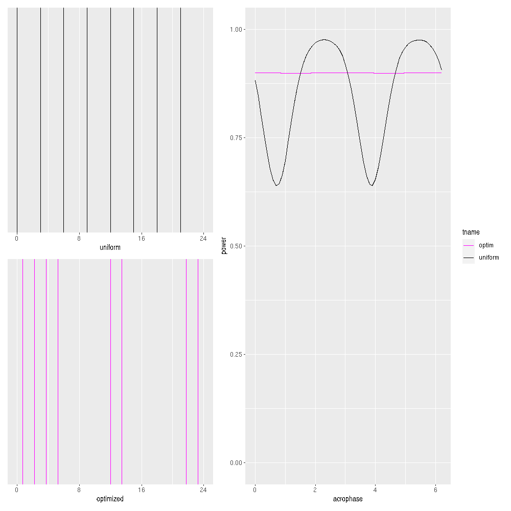
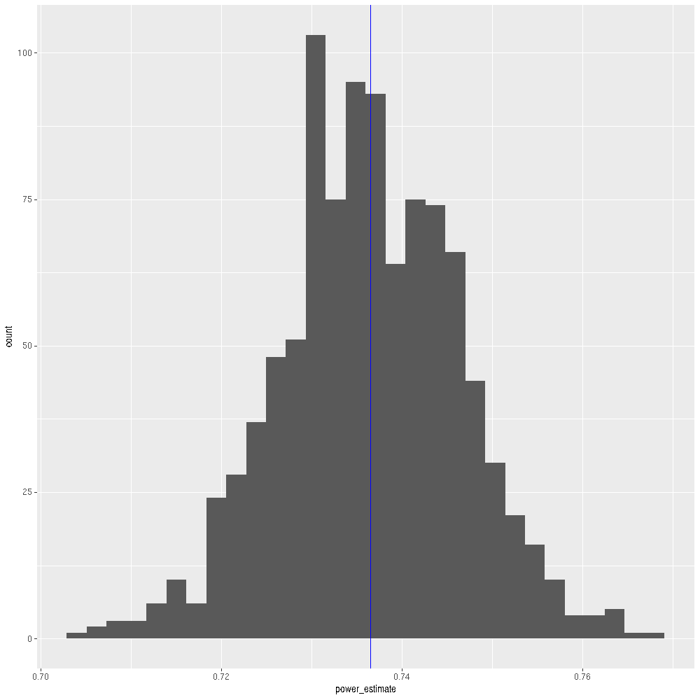

# Introduction to power optimization 


Outline:

1. How is period uncertainty related to irregular sampling?
2. What does our optimization method do?
3. What remains to be understood and implemented?


```r
library(stats)
library(dplyr)
library(ggplot2)
library(gurobi)
library(CVXR)
library(dplyr)
library(expm)
library(NlcOptim)
library(patchwork)
library(data.table)
source('rowCosinor.R')
```


```r
getPower <- function(t,param,alpha=.05){
# return power of one-frequency cosinor model
  Amp    = param[['Amp']];
  freq   = param[['freq']];
  acro   = param[['acro']];
  N      = length(t)
  
  cvec   = Amp*cos(2*pi*freq*t-acro);
  lambda = as.numeric(t(cvec)%*%cvec)
  
  f0     = qf(p=1-alpha,df1=2,df2=N-3)
  return(1 - pf(q=f0,df1=2,df2=N-3,ncp=lambda))
}
getPower_acrovec <- function(t,param,acrovec,alpha=.05){
# loop previous
  powervec = rep(NaN,length(acrovec))
  for (ii in 1:length(acrovec)){
    param$acro   = acrovec[ii]
    powervec[ii] = getPower(t,param,alpha)
  }
  return(powervec)
}

getMinPower <- function(t,param,alpha=.05){
# find minimum power over the interval from [0,2pi] 
  return(pracma::fminbnd(
        f = function(phi){param['acro']=phi
            return(getPower(t,param,alpha))},
        a = 0,
        b = 2*pi) %>% {.$fmin})
}

optPowerDirect<-function(t,param,alpha=.05){
  return(pracma::fmincon(x0=t,
                  fn=function(t){-getMinPower(t,param,alpha)},
                  lb=rep(0,length(t)),
                  ub=rep(1,length(t))))
}

optPowerLambda <- function(t,param,alpha=.05){
  N = length(t)
  pracma::fmincon(x0=t,
                  fn=function(t){
                      t     = matrix(t,nrow=N)
                      cvec  = cos(2*pi*param$freq*t)
                      svec  = sin(2*pi*param$freq*t)
                      fdet  = (t(cvec)%*%cvec)*(t(svec)%*%svec) - (t(cvec)%*%svec)^2
                      return(-0.5*(N - sqrt(N^2 - 4*fdet)))
                  },
                  lb=rep(0,length(t)),
                  ub=rep(1,length(t)))
}

getFIM <- function(t,param){
  Amp    = param[['Amp']];
  freq   = param[['freq']];
  acro   = param[['acro']];
  N      = length(t)
  
  Y = matrix(c(rep(1,length(t)),
           cos(2*pi*freq*t),
           sin(2*pi*freq*t)),
           nrow=3,byrow=T)

  Y %*% t(Y)
}
getReducedFIM <- function(t,param){
  Amp    = param[['Amp']];
  freq   = param[['freq']];
  acro   = param[['acro']];
  N      = length(t)
  
  Y = matrix(c(cos(2*pi*freq*t),
           sin(2*pi*freq*t)),
           nrow=2,byrow=T)
  Y %*% t(Y)
}
```

# Period uncertainty and irregular sampling 

## Acrophase can influence detection 

```r
N=8
time   = seq(from=0,to=1,by=.005)
tunif=(0:N)/N
tunif=tunif[1:(length(tunif)-1)]
signal = cos(2*pi*4*time) 
p1<-data.frame(time=time,signal=signal) %>%mutate(time_hr = 24*time) %>%  ggplot(aes(x=time_hr,y=signal))+
  geom_line(color='blue')+
  geom_vline(xintercept = 24*tunif,linetype='dashed')+ggtitle('high power')+
  scale_x_continuous(breaks=seq(from=0,to=24,by=8),limits=c(0,24))
signal = cos(2*pi*4*time-pi/2) 
p2<-data.frame(time=time,signal=signal) %>%mutate(time_hr = 24*time) %>%  ggplot(aes(x=time_hr,y=signal))+
  geom_line(color='red')+
  geom_vline(xintercept = 24*tunif,linetype='dashed')+ggtitle('low power')+
  scale_x_continuous(breaks=seq(from=0,to=24,by=8),limits=c(0,24))

p1/p2
```



## Only happens when oscillation is fast 

How do we remove this unwanted acrophase dependence?

```r
periods      = c(1,1/2,1/4,1/8,1/16,1/24)
circ_periods = 24*periods
freqs        = 1/periods

param=list(
  Amp=2,
  acro=0,
  freq=1
)
Nmeasvec     = seq(from=6,to=24,by=2)

acrovec = seq(from=0,to=2*pi,by=.1)

pdf<-lapply(Nmeasvec %>% as.list(),function(N){
  t = (0:N)/N
  t = t[1:(length(t)-1)]
  lapply(1:length(freqs) %>% as.list(), function(ind){
    param$freq = freqs[ind]
    powervec = getPower_acrovec(t,param,acrovec)
    return(data.frame(power=powervec,
                      acro=acrovec,
                      Nmeas=N,
                      freq=freqs[ind],
                      circ_period=circ_periods[ind]))
  })  %>% rbindlist()
}) %>% rbindlist()

pdf %>%  
  mutate(cp_label=factor(circ_period,levels=circ_periods,labels=paste0('Period = ',circ_periods,' hrs')))%>%
  mutate(budget  = as.factor(Nmeas)) %>% 
  ggplot(aes(x=acro,y=power,group=Nmeas,color=budget))+geom_line()+facet_wrap(~cp_label)+scale_color_viridis_d()
```



Theoretical explanation: **Experimental design and power calculation in omics circadian rhythmicity detection using the cosinor model** Zong et al. 2023.

- Power is constant when evenly sampling at least 3 times per cycle

# Our optimization method

Our approach: turn power optimization into a convex programming problem

For a given period (or range of periods)

- selects measurement times to maximize the power at all acrophases simultaneously
- avoids situation where you are always measuring at the MESOR

Example: 6.5hr oscillation in a circadian experiment

- (Black) Equally spaced measurements have oscillating power
- (Magenta) Oscillations are not present in the optimal design

```r
N     =  8 
t     = (0:N)/N  # Shifted by 1 from matlab
t     = t[1:(length(t)-1)]
tunif = t
param = list(Amp  = 2.5,
             acro = 0,
             freq = 24/6.5)

# cvx opt
Nfine = 2^5
Nmeas = N 

# generate sampling grid
tau   = (0:Nfine)/Nfine       # equally spaced
tau   = tau[1:(length(tau)-1)] 

# evaluate model at sampling points
cvec  = matrix(cos(2*pi*param$freq*tau),nrow=Nfine)
svec  = matrix(sin(2*pi*param$freq*tau),nrow=Nfine)

# vectors for constructing disciplined quadratic form
a11   = cvec*cvec
a22   = svec*svec
a12   = cvec*svec
bvec  = a11+a22
Amat  = a11%*%t(a11) + a22%*%t(a22) +4*a12%*%t(a12)-a11%*%t(a22) - a22%*%t(a11)
A12   = Re(expm::sqrtm(Amat))

x            = Variable(Nfine,boolean=T)
constraints  = list( sum(x) == Nmeas)
objective    = 0.5*(t(bvec)%*%x - CVXR::norm2(A12%*%x))
prob         = Problem(Maximize(objective),constraints)

# terminate when within  1e-2, 1% of optimality bound 
result       = solve(prob,verbose=F,num_iter=1e6,MIPGap=1e-4)

phi_vals=seq(from=0,to=2*pi,by=0.1)
pdf<-lapply(list(scheda=list(tname='uniform',t=tunif),
                 schedb=list(tname='optim',t=tau[result[[1]]>0])),
       function(sched){
          lapply(phi_vals %>% as.list(),
                 function(phi){
                    param$acro=phi
                    return(data.frame(tname=sched$tname,
                                      phi=phi,
                                      power=getPower(sched$t,param)))
          }) %>% rbindlist()
}) %>% rbindlist()


p1<-ggplot()+geom_vline(xintercept = 24*tunif,color='black')+
  scale_x_continuous(breaks=seq(from=0,to=24,by=8),limits=c(0,24))+xlab('uniform')
p2<-ggplot()+geom_vline(xintercept = 24*tau[result[[1]]>0],color='magenta')+
  scale_x_continuous(breaks=seq(from=0,to=24,by=8),limits=c(0,24))+xlab('optimized')

p3<-pdf %>% ggplot(aes(x=phi,y=power,group=tname,color=tname))+geom_line()+ylim(c(0,1))+
                scale_color_manual(values=c('optim'='magenta','uniform'='black'))+xlab('acrophase')

((p1/p2)|p3)
```




```r
#freqs = seq(from=1,to=24,by=.1)
#Amps  = 10^seq(-1,1.25,0.1)
#
#toptim = tau[result[[1]]>0]
#hmat<-expand.grid(freq=freqs,Amp=Amps ) %>% 
#  apply(1,function(x){
#    param$freq = x['freq'] 
#    param$Amp  = x['Amp'] 
#    punif  = getMinPower(tunif,param)
#    poptim = getMinPower(toptim,param)
#    df1 = data.frame(freq=x['freq'],Amp=x['Amp'],minPower=punif,sched='unif')
#    df2 = data.frame(freq=x['freq'],Amp=x['Amp'],minPower=poptim,sched='optim')
#    return(rbind(df1,df2))
#    }) %>% rbindlist()
#
#hmat %>% head()
#hmat %>% ggplot(aes(x=Amp,y=freq,z=minPower))+geom_contour_filled()+facet_wrap(~sched)
```

# Yet to be understood/implemented 

Summary:

- Using a uinform grid, phase dependent power happens because  MESOR can align with sampling grid
- For a single known frequency, our optimization protocol chooses sampling strategy to remove this

Ongoing work:

- Test our method on period windows
- Control possible biases in point estimators and periodogram 
- Allow customization of replicates

When not to use this:

- If you measure more than 3 times per cycle, very unlikely that irregular sampling will help (Zong et al. 2023)
- If noise is phase dependent, the theory we use is not applicable 


# Comparison of Monte Carlo and exact expression

Monte Carlo formula agrees with estimate

```r
# stat params 
N    = 8 
t    = (0:N)/N
t    = t[1:(length(t)-1)]
Nmc  = 2e3

# model params 
Amp  = 2
freq = 2
acro = 1

# simulate and fit 
monteCarloPval <-function(){
  Ydat = replicate(Nmc,{Amp*cos(2*pi*freq*t -acro) + rnorm(length(t))}) %>% t
  return(rowCosinor(Ydat,t,per=1/freq) %>% {.$pvalue <.05} %>% mean())
}

Nout = 1e3
param = list(Amp=Amp,freq=freq,acro=acro)
data.frame(power_estimate=replicate(Nout,{monteCarloPval()}) ) %>% ggplot(aes(x=power_estimate))+
  geom_histogram()+
  geom_vline(xintercept =getPower(t,param),color='blue')
```




<!-- Use HTML for horizontal lines instead of markdown (---) so
that rmarkdown render does not treat the markdown
as a YAML header -->

<hr></hr>

<details> <summary> Click to see page metadata </summary>

<div>


Computation Started: `2023-10-06 00:55:54.860567`

Finished in `20.91 secs`

<hr></hr>


**Git Log** 


No git history available for this page

---


**Packages**


|package     |version  |date       |
|:-----------|:--------|:----------|
|Matrix      |1.5-4    |2023-07-16 |
|bit         |4.0.5    |2023-04-21 |
|gtable      |0.3.4    |2023-08-22 |
|expm        |0.999-7  |2023-04-21 |
|Rmpfr       |0.9-3    |2023-08-09 |
|dplyr       |1.1.3    |2023-09-04 |
|compiler    |4.3.0    |2023-07-28 |
|renv        |1.0.3    |2023-09-20 |
|stats       |4.3.0    |2023-07-28 |
|tidyselect  |1.2.0    |2023-04-21 |
|Rcpp        |1.0.11   |2023-07-10 |
|slam        |0.1-50   |2023-04-21 |
|git2r       |0.32.0   |2023-04-22 |
|scales      |1.2.1    |2023-05-30 |
|lattice     |0.21-8   |2023-07-16 |
|base        |4.3.0    |2023-07-28 |
|ggplot2     |3.4.3    |2023-08-15 |
|R6          |2.5.1    |2023-04-21 |
|labeling    |0.4.3    |2023-08-30 |
|generics    |0.1.3    |2023-06-20 |
|patchwork   |1.1.3    |2023-08-15 |
|NlcOptim    |0.6      |2023-04-22 |
|knitr       |1.44     |2023-09-12 |
|MASS        |7.3-58.4 |2023-07-16 |
|datasets    |4.3.0    |2023-07-28 |
|methods     |4.3.0    |2023-07-28 |
|tibble      |3.2.1    |2023-07-10 |
|gurobi      |10.0-3   |2023-09-06 |
|munsell     |0.5.0    |2023-04-21 |
|pillar      |1.9.0    |2023-04-21 |
|rlang       |1.1.1    |2023-05-01 |
|utf8        |1.2.3    |2023-04-21 |
|CVXR        |1.0-11   |2023-07-10 |
|xfun        |0.40     |2023-08-10 |
|utils       |4.3.0    |2023-07-28 |
|quadprog    |1.5-8    |2023-04-21 |
|bit64       |4.0.5    |2023-04-21 |
|viridisLite |0.4.2    |2023-05-04 |
|cli         |3.6.1    |2023-05-30 |
|withr       |2.5.0    |2023-04-21 |
|magrittr    |2.0.3    |2023-04-21 |
|grid        |4.3.0    |2023-07-28 |
|rstudioapi  |0.15.0   |2023-07-10 |
|graphics    |4.3.0    |2023-07-28 |
|gmp         |0.7-2    |2023-07-03 |
|lifecycle   |1.0.3    |2023-04-21 |
|vctrs       |0.6.3    |2023-06-16 |
|evaluate    |0.21     |2023-05-08 |
|glue        |1.6.2    |2023-04-21 |
|data.table  |1.14.8   |2023-04-21 |
|farver      |2.1.1    |2023-04-21 |
|fansi       |1.0.4    |2023-04-21 |
|colorspace  |2.1-0    |2023-04-21 |
|grDevices   |4.3.0    |2023-07-28 |
|tools       |4.3.0    |2023-07-28 |
|pkgconfig   |2.0.3    |2023-04-21 |

---

**System Information**


|         |systemInfo                   |
|:--------|:----------------------------|
|version  |R version 4.3.0 (2023-04-21) |
|platform |x86_64-pc-linux-gnu (64-bit) |
|locale   |en_CA.UTF-8                  |
|OS       |Ubuntu 22.04.2 LTS           |
|UI       |X11                          |

**Scikick Configuration**


```bash
cat scikick.yml
```

```
### Scikick Project Workflow Configuration File

# Directory where Scikick will store all standard notebook outputs
reportdir: report

# --- Content below here is best modified by using the Scikick CLI ---

# Notebook Execution Configuration (format summarized below)
# analysis:
#  first_notebook.Rmd:
#  second_notebook.Rmd: 
#  - first_notebook.Rmd 	# must execute before second_notebook.Rmd
#  - functions.R 	        # file is used by second_notebook.Rmd
#
# Each analysis item is executed to generate md and html files, E.g.:
# 1. <reportdir>/out_md/first_notebook.md
# 2. <reportdir>/out_html/first_notebook.html
analysis: !!omap
- main.Rmd:
version_info:
  snakemake: 7.30.1
  ruamel.yaml: 0.17.32
  scikick: 0.2.1
```

---

**Functions**

  
 rowCosinor 
```r
function (theData, zts, per = 24) 
{
    Y <- as.matrix(theData)
    x1 <- sin(2 * pi * zts/per)
    x2 <- cos(2 * pi * zts/per)
    x0 <- rep(1, dim(Y)[2])
    X <- cbind(x0, x1, x2)
    betas <- solve(t(X) %*% X) %*% t(X) %*% t(Y)
    phases <- atan2(betas[2, ], betas[3, ])
    acrophases <- (((per/2)/pi) * (phases))%%per
    amplitudes <- 2 * sqrt(betas[2, ] * betas[2, ] + betas[3, 
        ] * betas[3, ])
    fits <- t(X %*% betas)
    SStot <- rowSums((Y - rowMeans(Y))^2)
    SSres <- rowSums((fits - Y)^2)
    Rsqs <- 1 - (SSres/SStot)
    SSmod <- SStot - SSres
    DFres <- ncol(theData) - 3
    DFmod <- 2
    MSres <- SSres/DFres
    MSmod <- SSmod/DFmod
    Fstatistic <- MSmod/MSres
    pval <- pf(Fstatistic, DFmod, DFres, lower.tail = FALSE)
    data.frame(acrophase = acrophases, amplitude = amplitudes, 
        mesor = betas[1, ], rsq = Rsqs, statistic = Fstatistic, 
        pvalue = pval)
}
<bytecode: 0x5608a2d11c38>
```


</div>
</details>

<!-- Project map inserted below after knitting -->

